# Contact API — Serverless Backend on AWS

A production-grade serverless contact form backend built with AWS Lambda, API Gateway, and DynamoDB. Features a fully automated CI/CD pipeline, environment separation, and complete observability with CloudWatch monitoring.

---

## Live Endpoints

| Environment | URL |
|---|---|
| **DEV** | `https://a0pk3m3vnk.execute-api.ap-south-1.amazonaws.com/dev` |
| **PROD** | Available in AWS Console (ap-south-1) |

---

## What This Project Does

Users submit contact form data via a REST API. Messages are stored in DynamoDB and can be retrieved with filters. The entire infrastructure is managed as code using Terraform, deployed automatically via GitHub Actions.

```
POST /contact     → validates input → saves message to DynamoDB
GET  /messages    → retrieves messages (filter by email or status)
```

---

## Architecture

```
User / Browser
      │
      ▼
API Gateway (HTTP API)   ← CORS enabled, ap-south-1
      │
      ├──────────────────────────────┐
      ▼                              ▼
Lambda: post_contact        Lambda: get_messages
  validates input              queries by email
  saves to DynamoDB            queries by status (GSI)
      │                              │
      └──────────────┬───────────────┘
                     ▼
               DynamoDB Table
           PK: email | SK: timestamp
           GSI: status-timestamp-index
```

**Observability layer:**
- CloudWatch log groups capture every Lambda invocation
- Structured logging with INFO / WARNING / ERROR levels
- CloudWatch alarms fire on error threshold breach
- SNS topic delivers email alerts automatically
- AWS Budgets prevents surprise billing

**CI/CD layer:**
- GitHub Actions triggers on every push to `main`
- DEV deploys first — PROD only deploys if DEV passes
- Terraform state stored remotely in S3 with DynamoDB locking


---

## Tech Stack

| Layer | Technology | Why |
|---|---|---|
| Compute | AWS Lambda (Python 3.11) | No server management, pay per request |
| API | API Gateway HTTP API | Cheaper than REST API, supports CORS |
| Database | DynamoDB | Serverless, scales automatically |
| IaC | Terraform | Reproducible, version-controlled infrastructure |
| CI/CD | GitHub Actions | Free for public repos, integrates with GitHub |
| Monitoring | CloudWatch + SNS | Native AWS, no extra tools needed |
| State | S3 + DynamoDB lock | Team-safe remote state management |

---

## API Reference

### POST /contact

Submit a contact form message.

**Request body:**
```json
{
  "name": "John Smith",
  "email": "john@example.com",
  "subject": "Hello",
  "message": "Your message here"
}
```

**Required fields:** `name`, `email`, `message`

**Success response (200):**
```json
{
  "message": "Contact form submitted successfully",
  "id": "2026-04-11T10:30:00Z",
  "email": "john@example.com"
}
```

**Error response (400):**
```json
{
  "error": "Missing required fields",
  "missing": ["email", "message"]
}
```

---

### GET /messages

Retrieve stored messages with optional filters.

**Query parameters:**

| Parameter | Example | Description |
|---|---|---|
| `email` | `?email=john@example.com` | Messages from a specific email |
| `status` | `?status=new` | Filter by status (new / read / archived) |
| `limit` | `?limit=10` | Max results (default: 50) |

**Example requests:**
```bash
# Get all messages
curl https://<api-url>/dev/messages

# Filter by email
curl https://<api-url>/dev/messages?email=john@example.com

# Filter by status
curl https://<api-url>/dev/messages?status=new
```

---

## DynamoDB Design

**Table:** `contact-messages-dev` / `contact-messages-prod`

| Key | Attribute | Type | Purpose |
|---|---|---|---|
| Partition key | `email` | String | Group messages by sender |
| Sort key | `timestamp` | String (ISO 8601) | Order messages by time |
| GSI partition | `status` | String | Query by new/read/archived |
| GSI sort | `timestamp` | String | Order results within status |

**Why this design?**

The main table answers "show me all messages from X" efficiently using the email partition key. The GSI answers "show me all unread messages" efficiently using the status partition key. Without the GSI, getting all unread messages would require a full table scan.

---

## Project Structure

```
contact-api/
├── .github/
│   └── workflows/
│       └── terraform.yml          ← CI/CD pipeline
├── environments/
│   ├── dev/
│   │   ├── main.tf                ← All AWS resources
│   │   ├── variables.tf
│   │   ├── outputs.tf
│   │   ├── backend.tf             ← Remote state config
│   │   └── terraform.tfvars       ← Dev-specific values
│   └── prod/
│       ├── main.tf
│       ├── variables.tf
│       ├── outputs.tf
│       ├── backend.tf
│       └── terraform.tfvars       ← Prod-specific values
└── lambda/
    ├── post_contact.py            ← POST handler
    └── get_messages.py            ← GET handler
```

---

## Environment Differences

| Setting | DEV | PROD |
|---|---|---|
| Point-in-time recovery | Disabled | **Enabled** |
| Log retention | 7 days | 30 days |
| Alarm error threshold | 2 errors / 5 min | **1 error / 1 min** |
| Alarm duration threshold | 5000ms | **3000ms** |

PROD is deliberately stricter — one error in production affects real users.

---

## CI/CD Pipeline

```
Push to main branch
        │
        ▼
terraform init + plan (DEV)
        │
        ▼
terraform apply (DEV)          ← stops here if this fails
        │
        ▼
terraform init + plan (PROD)
        │
        ▼
terraform apply (PROD)
```

Every push triggers `terraform plan` (safe, no changes). `terraform apply` only runs on merge to `main`. PROD deployment is blocked if DEV fails — this prevents broken code reaching production.

---

## Observability

**Reading logs:**
```
AWS Console → CloudWatch → Log groups
→ /aws/lambda/contact-messages-post-dev
→ /aws/lambda/contact-messages-get-dev
```

**Log levels used:**

| Level | When |
|---|---|
| `INFO` | Normal operations (request received, saved successfully) |
| `WARNING` | Bad input (missing fields, invalid email format) |
| `ERROR` | Unhandled exceptions (DynamoDB down, broken JSON) |

**Alarms configured:**
- Lambda error count exceeds threshold → SNS email alert
- Lambda duration exceeds threshold → SNS email alert

---

## Trade-offs & Design Decisions

**Lambda over ECS/EC2**
Contact forms have unpredictable, low-frequency traffic. Lambda costs nothing when idle and scales automatically. ECS would cost ~$15/month minimum even with zero traffic.

**DynamoDB over RDS**
No complex joins needed — messages are retrieved by email or status only. DynamoDB's access patterns match perfectly and there is no server to manage. RDS would require a VPC, subnet groups, and ongoing maintenance.

**HTTP API over REST API**
HTTP API is 70% cheaper than REST API for the same functionality. The only missing feature is request/response transformation, which is not needed here.

**Separate dev and prod environments**
Changes are tested in DEV before reaching real users in PROD. Separate Terraform state files mean a failed DEV deployment cannot corrupt PROD state.

**Terraform over console clicks**
All infrastructure is reproducible and version-controlled. A new team member can deploy the entire stack with `terraform apply`. Console-created resources are invisible to code review.

---

## Setup & Deployment

**Prerequisites:** AWS CLI, Terraform >= 1.0, Python 3.11

**Clone and deploy to DEV:**
```bash
git clone https://github.com/anushamaryam2406-ops/contact-api-terraform
cd contact-api-terraform/environments/dev
terraform init
terraform plan
terraform apply
```

**Deploy via CI/CD:**
```bash
git add .
git commit -m "your change"
git push origin main
# GitHub Actions handles the rest
```

---

## Author

**Anusha Maryam** — AWS Cloud Engineer  
GitHub: [@anushamaryam2406-ops](https://github.com/anushamaryam2406-ops)  
Region: ap-south-1 (Mumbai)
